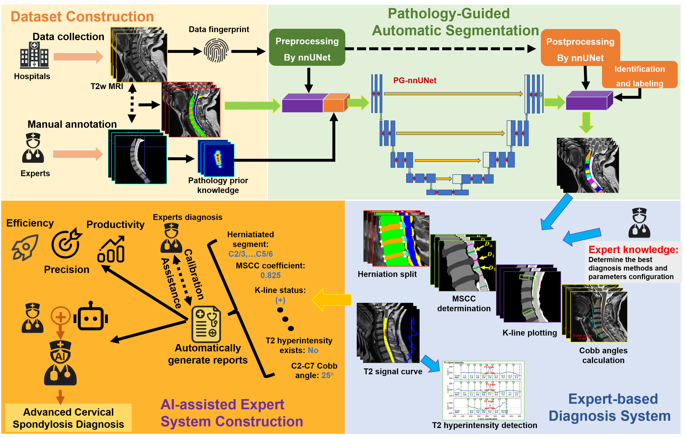
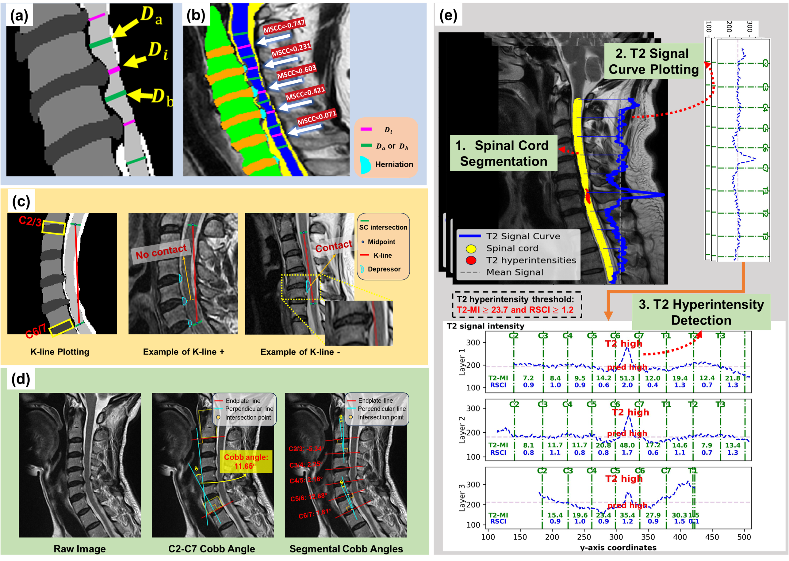

# CervAI-X: Cervical AI (E)Xpert System
**An Expert-Knowledge Driven Diagnostic Framework for Comprehensive Cervical Spondylosis Assessment**  
## 🎯 Clinical Value Proposition  
CervAI-X is an AI-powered diagnostic system that automates quantitative evaluation of cervical spondylosis through five clinically validated indicators:  
1. **C2-C7 Cobb Angle Measurement**  
2. **Disc Herniation Localization & Severity Grading**  
3. **Maximum Spinal Cord Compression (MSCC) Quantification**  
4. **Modified K-Line Status Assessment**  
5. **T2-Hyperintensity Detection with Novel Biomarkers**

Validated on 960 clinical MRI cases, it achieves **expert-level precision** (MAE: 2.44°±1.93° for Cobb angle, 3.60%±2.37% for MSCC) while reducing interpretation time by 85% compared to manual analysis.

The workflow of the complete CervAI-X includes the segmentation model (PG-nnUNet) and the expert-based diagnosis framework, as illustrated as follows:


## 📁 Data Requirements
- **Input Format**: Cervical spine MR T2w images in NIfTI (.nii.gz)
- **Required Annotations**: also in NIfTI (.nii.gz)
  - 1: Vertebral bodies (V)
  - 2: Intervertebral discs (IVD)
  - 3: Spinal cord (SC)
  - 4: Cerebrospinal fluid (CSF)

**Note**: You have to segment these anatomies firstly. Refer to [nnUnet](https://github.com/MIC-DKFZ/nnUNet) to obtain the usage of nnU-Net. We also release our PG-nnUNet (based on nnUNet v1), which is modified nnUNet for segmenting cervical spondylosis images. The details can be found in our paper below. The trained weights (including both PG-nnUNet and nnUNet v2) can be found: https://huggingface.co/ZhangqiSJTU/CervAI-X. The inference process is consistent with [nnUnet](https://github.com/MIC-DKFZ/nnUNet).

## Dataet Structure
```
/dataset/
  ├── target_folder
      ├── gt/
      │   ├── 0001.nii.gz    # Segmentation Ground Truth
      │   └── 0002.nii.gz    
      ├── pred/
      │   ├── 0001.nii.gz    # Segmentation Prediction
      │   └── 0002.nii.gz   
      └── img/    
          ├── 0001.nii.gz    # Original T2w Image
          └── 0002.nii.gz   
```

---

**Note**: You can find examples (including MRI images and corresponding annotations in .nii.gz format) in the https://huggingface.co/ZhangqiSJTU/CervAI-X. These examples can be directly used in the diagnosis validation.

## 🛠 Core Modules
**Note**: This is the brief introduction to the diagnosis modules of CervAI-X, not including segmentation (PG-nnUNet). 

### 1. Protrusion Analysis & Annotation
**Module Function**:
This module first applied `dagnosis/seg_protrude.py` extracts the segmentation of IVD protrusions and saves the results in the output path. Then `./dagnosis/herniation_labeling.py` automatically detects and annotates protruded regions.

**Key Features**:
1. Connected Component Analysis & Filtering:
   - Performs connected region detection on protruded areas
   - Filters components using anatomical labels (e.g., disc tags) and spatial positional criteria
   - Excludes non-adjacent regions through positional relationship analysis
   - Preserves only clinically significant protrusions

2. Automated Annotation & Visualization:
   - Adds red arrow annotations indicating protrusion direction
   - Labels anatomical structures (e.g., C2-C7 vertebrae) near target regions
   - Outputs PNG images with light gray background for optimal contrast

3. Advanced Features (2024/09/02 Update):
   - Implements spinal canal-side protrusion filtering
   - Records protrusion locations by intervertebral disc segment
   - Generates structured Excel reports with positional metadata

**Usage**:
```bash
python seg_protrude.py --main_folder ./dataset/target_folder --save_folder ./dataset/save_folder 
python herniation_labeling.py \
  --main_folder ./dataset/target_folder \  
  --save_folder ./dataset/save_folder \
  --arrow_label 5 \  # the label number of arrows 
  --text_label 2 \   # the label number of text 
  --ivd_label 1      # the label number of IVD
```

**Note**: If the `main_folder` is consistent with `save_folder`, the following steps are easier.

### 2. MSCC Calculation
**Module Function**:
This module processes MRI images and their corresponding segmentation labels to generate middle layer images, calculate the maximum MSCC (maximum spinal cord compression) for each segment, and save the results in an Excel file.

**Formula**:
$$
\text{MSCC} = \left(1 - \frac{D_i}{\frac{D_a + D_b}{2}}\right) \times 100\%
$$
- $D_i$: Narrowest diameter at herniation level
- $D_a/D_b$: Normal diameters above/below compression

**Usage**:
```bash
python MSCC.py \
  --main_folder ./dataset/target_folder \
  --save_folder ./dataset/save_folder \
```

**Note**: You have to run `dagnosis/seg_protrude.py` to obtain the `pred_protrude` folder firstly. The `pred_protrude` folder should in the the same root path with the `img` folder.

**Outputs**:
- Middle layer images with lines drawn on them (saved as .png files).
- An Excel file listing the maximum MSCC and corresponding segment for each file.

### 3. Modified K-Line Drawing
**Module Function**:
This module processes MRI images and their corresponding segmentation labels to generate K-line images 
and check for intersections with protrusion (labels 5, indicating compressive lesions here). The Kline negatives (indicates contact) suggests avoiding posterior decompression surgery due to poor prognosis.

**Usage**:
```bash
python Kline.py \
  --main_folder ./dataset/target_folder \
  --save_folder ./dataset/save_folder \
```

**Note**: You have to run `dagnosis/seg_protrude.py` to obtain the `pred_protrude` folder firstly. The `pred_protrude` folder should in the the same root path with the `img` folder.


**Outputs**:
- K-line images with lines drawn on them (saved as .png files).
- A text file listing names of files where intersections with labels 5 or 7 occur.

### 4. Cobb Angle Calculation
**Module Function**:
This module processes MRI images and labels to calculate Cobb angles for cervical vertebrae (C2-C7).
It reads images and labels from the target directory, computes the Cobb angles, and saves the results as images and a summary text file.

**Functions Inside**:
- calculate_cobb_angle: Calculate Cobb angle given four points.
- plot_cobb_angle: Plot Cobb angle on an image.
- process_patient_C27: Process images and labels for a patient and compute Cobb angles.

**Usage**:
```bash
python Cobb_C27.py \
  --main_folder ./dataset/target_folder \
  --save_folder ./dataset/save_folder \
  --if_show False
```

**Note**: You have to run `dagnosis/seg_protrude.py` to obtain the `pred_protrude` folder firstly. The `pred_protrude` folder should in the the same root path with the `img` folder.

### 5. Detection of T2 hyperintensity
**Module Function**:
This module consists of three main steps: spinal cord segmentation, `T2 − SI` curve plotting, and specific indicators computation. 

**Quantitative Indices**:
- **T2 Myelopathy Index (T2-MI)**:
$$
T2\text{-}MI = \frac{T2\text{-}SI_{max} - T2\text{-}SI_{min}}{T2\text{-}SI_{mean}}
$$

- **Relative Signal Change Index (RSCI)**:
$$
RSCI_i = \frac{3 \times T2\text{-}MI_i}{\sum_{k=i-1}^{i+1} T2\text{-}MI_k}
$$

**Diagnostic Thresholds**:
- RSCI ≥ 1.2
- T2-MI ≥ 23.7 (Youden Index = 0.807)

**Usage**:
```bash
python T2_highsignal.py \
  --main_folder ./dataset/target_folder \
  --save_folder ./dataset/save_folder \
```

**Note**: You have to run `dagnosis/seg_protrude.py` to obtain the `pred_protrude` folder firstly. The `pred_protrude` folder should in the the same root path with the `img` folder.

---

## 📧 Contact
If you have any questions about the codes or paper, please let us know via [zhi-bai-shou-hei@sjtu.edu.cn](zhi-bai-shou-hei@sjtu.edu.cn).

---

## 🙇‍ Acknowledgment
- Thank Febian's [nnUnet](https://github.com/MIC-DKFZ/nnUNet).

---


## 📄 License

This implementation is for research purposes only. Clinical use requires additional certification. All rights reserved by Renji Hospital and SJTU Med-X Institute.